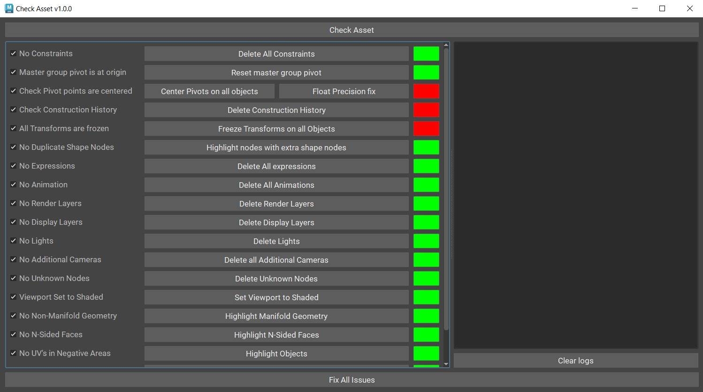
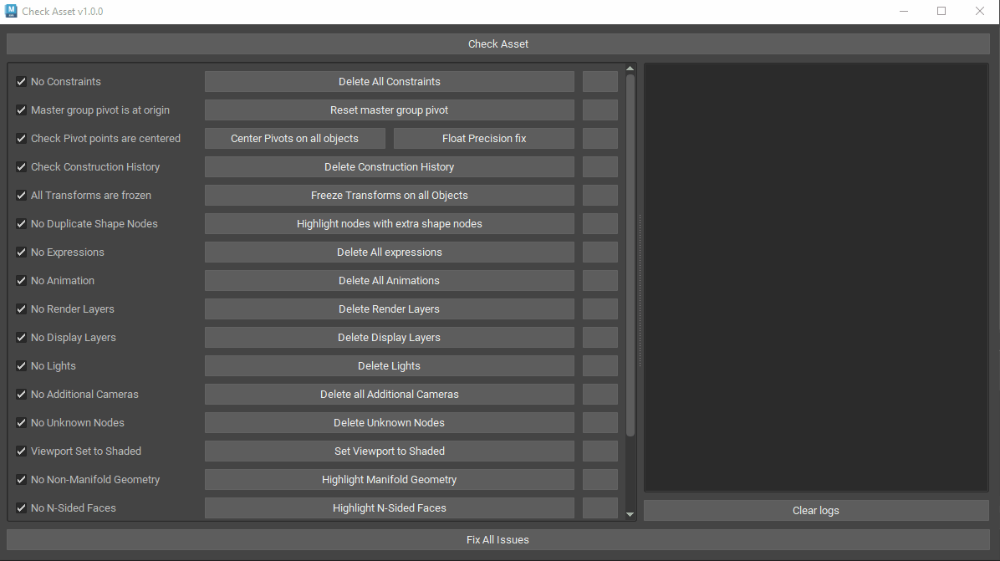

# model_check
This tool does sanity check on your model scene file in **Autodesk Maya 2024**.
This tool ensures your model scene file is ready for next department to use it.

## Tool

## Usage

## Support
Raise issue in Issue-Tracker

## Installation
* Clone the repo or download the zip.
* open "model_check_shelf.py" in sublime/PyCharm/mayaScript editor
* provide the path of the folder where you have saved the script eg: <provide_file_path>\\\model_check\\\
* Drag and save the script in maya shelf with the new path
* Edit>Shelves>(IconName)FolderButton>(browse icon1 from images folder)
* Edit>Shelves>Tooltip>Model Check

https://digdeeperts.wordpress.com/2019/03/21/maya-how-add-shelf-to-env/

[model_check_shelf.py](model_check_shelf.py) -> to launch the tool 

## License
[BSD-3](https://github.com/blossomsg/model_check/blob/main/LICENSE)
